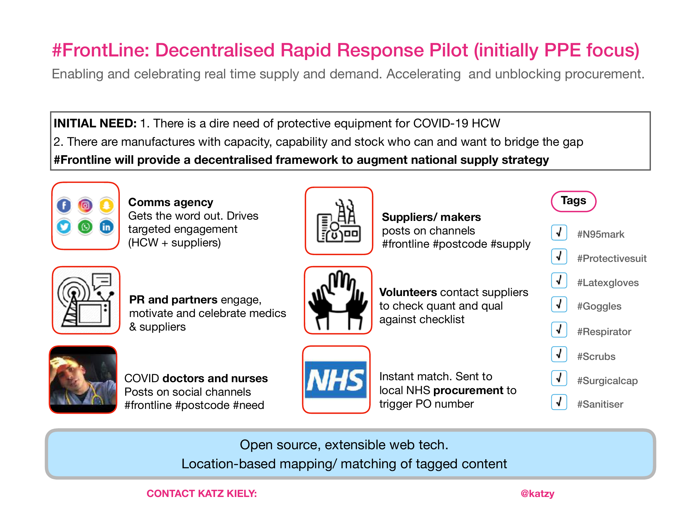
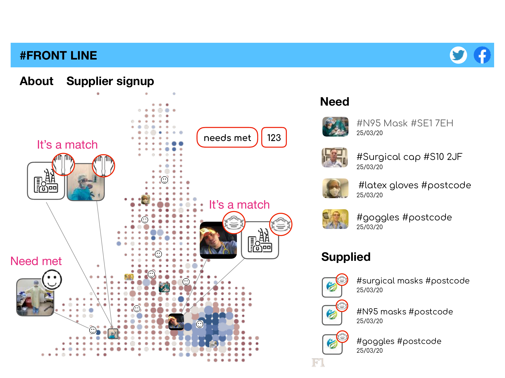

# open-distribution

Open, bottom-up distribution requests

## Problem statement

Manufacturers and suppliers may have stock but lack oversight of where it is needed.

Frontline staff should be able to highlight needs and make requests in a bottom-up way which
might be supplied by smaller purchase orders to complement top-down logistics.

## What it does

Allows frontline health staff to notify of PPE shortgages, compile those requests to a
database with geolocation. Publish open data of the requests and status (met or needed) to
allow market to deliver and inform others of opportunties to produce solutions (could be
manufactureres looking to pivot to new sector or 3D printed visor components etc). Same data
can be used by others to understand the issues and raise awareness to find solutions to non
logistical aspects ie stock hoarding

## Proof of concept idea

1. Media agency will spread word of platform, testing in Yorkshire to frontline workers to
   tweet their needs
2. Bot watches Twitter ~~and facebook~~ for key hash tags. Facebook/Instgram have no open
   access to posts.
3. Bot responds with webform having checked request contains postcode with NHS premises
   (& care homes?)
4. User fills in simple webform
5. Webform published to database and front end with map and request details
6. Request matched with supply, enable purchase order to be made, thank all concerned

## Values: open design, open source, open data

We're designing and building this in the open. Please contribute.

All data involved will be openly created, collected and maintained. Here's an [Open Data
Institute Guide to Collaborative Data
Maintenance](https://collaborative-data.theodi.org/what-is-collaborative-maintenance/).

## Who

- Katz Kiely
- Dominic Humphrey
- Tom Russell
- &hellip;

## Initial Design

